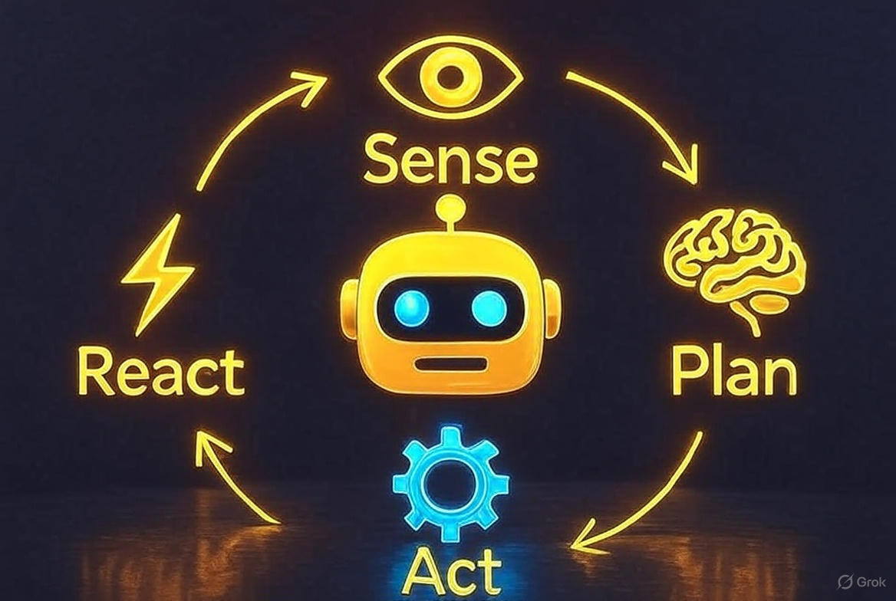

<div align="center">

# ⚡️ **Agent Starter**

### *Local AI Autonomy — Powered by FastAPI × Ollama (Llama 3)*

[](https://www.python.org/)
[](https://fastapi.tiangolo.com/)
[](https://ollama.ai/)
[](LICENSE)

> Build, deploy, and run intelligent agents **fully offline** — no APIs, no cloud, no gatekeepers.

</div>

---

<div align="center">

## 🚀 **Overview**

</div>

**Agent Starter** is a minimal yet production-ready template for creating local AI agents that can **plan, act, and reflect** using your own hardware.

It includes:

* ⚙️ **FastAPI** backend to orchestrate message flow
* 🤖 **Ollama-powered LLMs** (Llama 3, Mistral, etc.) for reasoning and response
* 🧩 **Tool interface** (currently `web.fetch`) for real-world actions
* 🧠 **Short-term memory** for contextual continuity
* 🔁 **Sense → Plan → Act → Reflect** control loop
* 🌐 Optional live web retrieval & summarization

---
<p align="center">
  
  <br><sub><em>Autonomous loop: Sense → Plan → Act → Reflect</em></sub>
</p>

<div align="center">

## 💡 **Quickstart**

</div>

```bash
# 1. Clone and set up
git clone git@github.com:ben-scire/agent-starter.git
cd agent-starter
python -m venv .venv && source .venv/bin/activate
pip install -e .

# 2. Create .env
echo "LLM_PROVIDER=ollama
LLM_MODEL=llama3.1:8b-instruct-q4_K_M
LLM_BASE_URL=http://172.17.128.1:11434" > .env

# 3. Run FastAPI
uvicorn api.main:app --reload --env-file .env

# 4. Test
curl -s http://127.0.0.1:8000/chat \
  -H "Content-Type: application/json" \
  -d '{"query":"Fetch https://en.wikipedia.org/wiki/Artificial_intelligence and summarize it."}'
```

---

<div align="center">

## 🧩 **Architecture & Example**

</div>

#### **Agent Flow**

```
FastAPI  (api/main.py)
└── SingleAgent.run()
    ├── Plan → uses Llama (via Ollama)
    ├── Act  → calls allowed tools (e.g., web.fetch)
    ├── Reflect → evaluates and summarizes
    └── Memory → stores short-term context
```

Llama 3 runs locally via Ollama at `http://127.0.0.1:11434`.

#### **Example Query**

```bash
curl -s http://127.0.0.1:8000/chat \
  -H "Content-Type: application/json" \
  -d '{"query":"Summarize https://en.wikipedia.org/wiki/Quantum_computing in 2 sentences."}'
```

#### **Example Response**

```json
{
  "summary": "Quantum computing leverages quantum-mechanical phenomena to perform computations that are infeasible for classical systems. It promises exponential speedups for specific problems like factorization and simulation.",
  "citations": []
}
```

---

<div align="center">

## 🧰 **Core Components**

</div>

| **Feature**      | **File**         | **Description**                   |
| ---------------- | ---------------- | --------------------------------- |
| Core agent logic | `core/agent.py`  | Sense → Plan → Act → Reflect loop |
| Memory manager   | `core/memory.py` | Stores contextual exchanges       |
| LLM interface    | `core/llm.py`    | Routes messages to Ollama         |
| Web tool         | `tools/web.py`   | Fetch + clean webpage text        |
| API endpoint     | `api/main.py`    | FastAPI routes for `/chat`        |

Add new tools (filesystem, browser automation, crypto APIs, etc.) and plug them into the `allowed_tools` whitelist.

---

<div align="center">

## 🧑‍💻 **Why This Matters**

</div>

Most “agent frameworks” hide behind APIs and paywalls.
This one runs *entirely local*, letting you:

* Inspect every request and response
* Prototype new agent behaviors
* Benchmark real LLM latency on-device
* Run safely offline

It’s built for engineers who want transparency and total control over their agents.

---

<div align="center">

## 🪄 **Coming Soon**

</div>

* Multi-agent orchestration (Maestro, Scrubsy, Vegas)
* Persistent memory store
* CLI + simple web UI
* Optional GPU inference benchmark mode

---

<div align="center">

## ⚖️ **License**

</div>

MIT © 2025 Ben Scire

---

<p align="center"><sub>“Build tools, not dependencies.”</sub></p>
